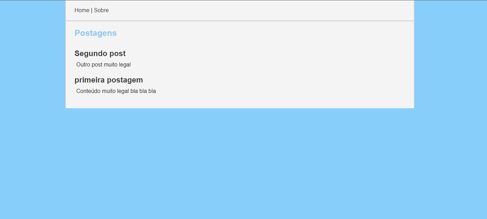
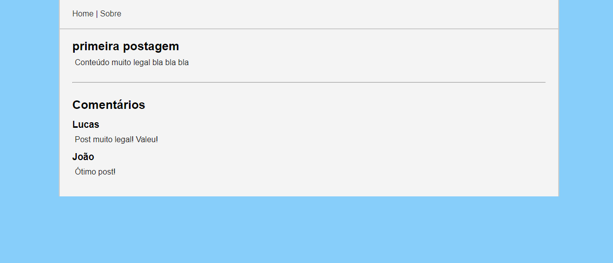

# Simple Blog System

## Sistema de blog simples feito com PHP / POO / MVC

Agradecimentos ao [Rafael Capoani](https://github.com/RafaelCapo){:target="_blank"} por seu [tutorial no YouTube explicando](https://www.youtube.com/watch?v=Y0DfK_lXu_M&list=PLgbAYUnxJ2NE6eM2xkOlpqJ5sl37bLyKx){:target="_blank"} conceitos e técnicas de MVC em PHP.

Optei por adicionar alguns conceitos ao projeto, como Namespaces e o autoload do Composer.

Abaixo seguem alguns prints, porém deixo claro que o projeto ainda está em progresso e futuras modificações serão documentadas aqui.

Página Inicial:

Página de uma postagem (view Single):

